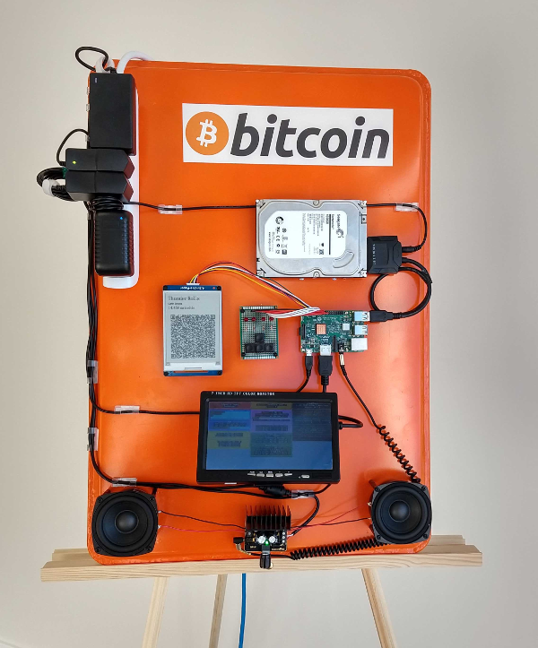
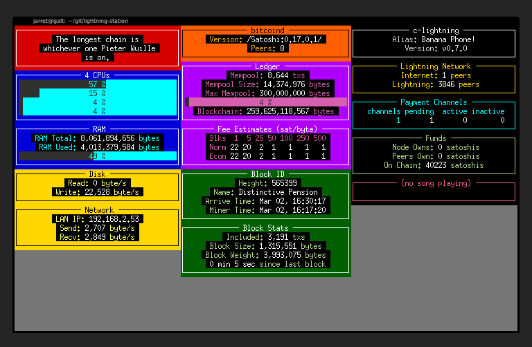

<<<<<<< HEAD
Overview
=======
Lightning Network Hardware Jukebox
>>>>>>> 0f59092... prep repo for lightning hack submission
-----

<<<<<<< HEAD
This is the application code for the Lightning Network Jukebox system. It also has a console that displays real-time stats about the system, `bitcoind` and `c-lightning`.

You can see a demo and explanation of this here: 

Note
-----

This software is early, has bugs and is a weekend tinker project.
=======
Overview
-----

This is the application code for the Lightning Network Jukebox. It also has screen output that displays real-time stats about the system, `bitcoind` and `c-lightning`. It use Twisted as the event loop and utilizes `urwid` to display the `ncurses` output to the terminal.

Video
------

A [video](https://youtu.be/sI-vs-2yrCQ) was recorded for a submission to the [Bitcoin Games 2019](https://bitcoingames2019.devpost.com/) which gives a quick introduction to this project and shows it in operation.

Show me some code\!
-----

* [screen_ui.py](screen_ui.py) - The module which draws the data output widgets to the terminal using the `urwid` framework.
* [jukebox.py](jukebox.py) - Logic for the jukebox, which manages Lightning Network invoices, check for them being paid and also plays and queues songs.
* [block_listener.py](block_listener.py) - Listens for block arrivals via ZeroMQ
* [node_info.py](node_info.py) - Calls to collect node info utilizing the RPC interface of `bitcoind` and the `pylightning` package for `c-lightning`.
* [qrdraw.py](qrdraw.py) - logic for generate rectangle draw instructions for the e-ink from a BOLT11 invoice.

Running without a Raspberry Pi
-----

This software can run on a Linux system that is also running `c-lightning` and `bitcoind`. Invoking `main.py` with similar parameters as seen in [run_dev.sh](run_dev.sh) will launch the updating stat output. This will serve a localhost web interface replacement for the GPIO e-ink and buttons. The Linux system will still require the same package dependencies and additionally require the `autobahn` Python package and `mpg123-pulse` utility to be in the PATH.

Launch parameters
-----

The parameter parsing is done in [main.py](main.py) with `argparse` which generates usage output when run with the `-h` flag. [run_dev.sh](run_dev.sh) and [run_pi.sh](run_pi.sh) specify parameters uses by the authors.

Music Setup
-----

This repository does not distribute any `.mp3` music for the jukebox. The dictionary declaration [jukebox.py](jukebox.py) specifies the artist, title, price and mp3 file location. The directory holding the files must be provided as a launch argument.

Debugging
-----

Using the `--console` option will skip running the `urwid` console frontend and will instead dump verbose activity logs to standard out. If there are exceptions, they can be seen much easier in this output.

Running on a Raspberry Pi.
-----

The script [run_pi.sh](run_pi.sh) gives example parameters for running this on the Raspberry Pi 'production' environment.

Hardware Setup
-----

The GPIO needs to be configured for the UART interface to drive the Waveshare e-ink display. It is highly recommended you first run and test this e-ink setup by following the documentation in [this repository](https://github.com/jarret/raspi-uart-waveshare). It uses [the same module to drive the e-ink display](waveshare/epaper.py) There, you will also find test programs for the 4-button and 4-LED GPIO interface.

This will include disabling the serial port console, enabling the UART interface and by disabling the bluetooth module on the Raspberry Pi 3.

Software Setup
-----

This may be incomplete. If it fails to launch, you might need to install additional packages beyond the ones here.

    $ sudo apt-get update
    $ sudo apt-get install libpython-dev python3-rpi.gpio python3-pip libopenjp2-7 libtiff5 fbterm espeak screen omxplayer
    $ pip3 install -U pylightning
    $ pip3 install -U pyserial
    $ pip3 install -U pillow
    $ pip3 install -U qrcode
    $ pip3 install -U twisted
    $ pip3 install -U autobahn
    $ pip3 install -U mutagen
    $ pip3 install -U urwid
    $ pip3 install -U pytz
    $ pip3 install -U txzmq

Console Setup
-----

This is intended to run under Raspbian Lite which does not have any graphical interface. The terminal built into the Linux kernel only supports 16 colors, so to get the `urwid` console output displaying in full color you will need to run a different software terminal.

`fbterm` seems to work quite well, however to get the 256 color output, you will need to export the `TERM` environment variable after launching fbterm like so:

    $ export TERM=fbterm

Other Notes
----

Depending on the LCD display, there may need to be special parameters specified in the Raspberry Pi's boot configuration take advantage of its native resolution.

Also, the `~/.fbtermrc` config file can be customized to specify font and font size settings for `fbterm`.
>>>>>>> 0f59092... prep repo for lightning hack submission

Parts
-----

* Mount backboard
    * Aluminum industrial bun pan
    * Spray paint primer
    * Spray paint orange gloss
    * Paintable caulk
    * Hex spacers
    * HDD and power bar mounting bolts
    * HDD and power bar mounting nuts
    * Bumper sticker

* Power
    * Power Bar
    * 12v 4A power supply
    * Pi power supply
    * Cable tie-downs
    * Cable ties

* Pi
    * Raspberry Pi 3
    * Raspberry Pi heat sink
    * SD Card

* Storage
    * 1TB hard drive
    * SATA to USB 3.0

* Button
    * 4 LEDs
    * 4 Push Buttons
    * 4 220 ohm resistors
    * prototype board
    * header pins
    * GPIO jump cables
    * capacitors

* Screen
    * LCD HDMI Display
    * Waveshare 800x600 UART display

* Audio
    * Amplifier
    * Speaker Wire
    * Speakers
    * 3.5mm coiled M-M audio cable

* Deployment
    * Extension Cable
    * Art Easel

* Misc
    * Solder
    * Drill Bits

<<<<<<< HEAD
Running this software without the hardware
-----

If you have a Linux system running `c-lightning` and `bitcoind`, you can run this software inside a terminal by invoking `main.py` with similar parameters as seen in [run_dev.sh](run_dev.sh). This will serve the jukebox interface with a HTTP server and interface. This is useful for development away from the full unit. The Linux system will still require most of the dependencies and additionally require, `autobahn` for the websocket server part.

Debugging
-----

Using the `--console` option will skip running the `urwid` console frontend and will instead dump verbose activity logs to standard out. If there are exceptions, they can be seen much easier in this output.

Running this software with the hardware
-----

The script [run_pi.sh](run_pi.sh) gives example parameters for running this on the Raspberry Pi 'production' environment.

Hardware Setup
-----

The GPIO needs to be configured for the UART interface to drive the Waveshare e-ink display. It is highly recommended you run and test this setup by following the documentation in [this repository](https://github.com/jarret/raspi-uart-waveshare). It uses [the same module to drive the e-ink display](waveshare/epaper.py) There, you will also find test programs for the 4-button and 4-LED GPIO interface.

This will include disabling the serial port console, enabling the UART interface and by disabling the bluetooth module on the Raspberry Pi 3.

Software Setup
-----

This may be incomplete - I have only set this up on the one unit during development and haven't documented the process. If it fails to launch, you might need to install additional packages beyond the ones here.

    $ sudo apt-get update
    $ sudo apt-get install libpython-dev python3-rpi.gpio python3-pip libopenjp2-7 libtiff5 fbterm espeak screen
    $ pip3 install -U pyserial
    $ pip3 install -U pillow
    $ pip3 install -U qrcode
    $ pip3 install -U twisted
    $ pip3 install -U autobahn
    $ pip3 install -U pylightning
    $ pip3 install -U mutagen
    $ pip3 install -U urwid
    $ pip3 install -U pytz

Console Setup
-----

This is intended to run under Raspbian :ite which does not have any graphical interface. The terminal built into the Linux kernel only supports 16 colors, so to get the `urwid` console output displaying in full color you will need to run a different software terminal.

`fbterm` seems to work, however to get the 256 color output, you will need to export the `TERM` environment variable after launching fbterm like so:

    $ export TERM=fbterm

Music Setup
-----

This repository does not distribute any `.mp3` music for the jukebox, obviously. The dictionary declaration [jukebox.py](jukebox.py) specifies the artist, title, price and mp3 file location. The directory location must be provided as a launch argument.

Other Notes
----

Depending on the LCD display, there may need to be special configuration parameters given to take advantage of its native resolution.

Also, the `~/.fbtermrc` config file can be customized to specify font and font size settings.

License
----

This code is licensed under the MIT License as defined in LICENSE. Have Fun!

The e-ink display stuff under `waveshare/` is also MIT. The main repo, test programs and documentation is in [this repository](https://github.com/jarret/raspi-uart-waveshare).
=======
License
----

This source code is licensed under the MIT License as defined in LICENSE.

The e-ink display stuff under `waveshare/` is also MIT. The main repo, test programs and documentation is in [this repository](https://github.com/jarret/raspi-uart-waveshare).

The images and text in description of this project is made available to the public under the [Creative Commons Attribution-NoDerivatives 4.0 International (CC BY-ND 4.0)](https://creativecommons.org/licenses/by-nd/4.0/)
>>>>>>> 0f59092... prep repo for lightning hack submission
